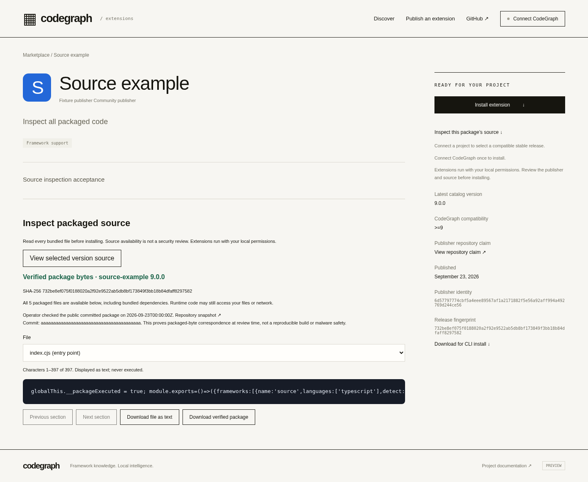
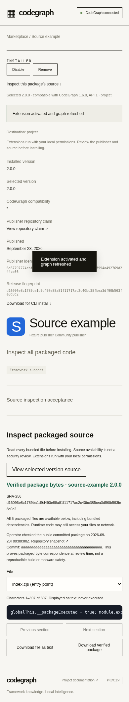
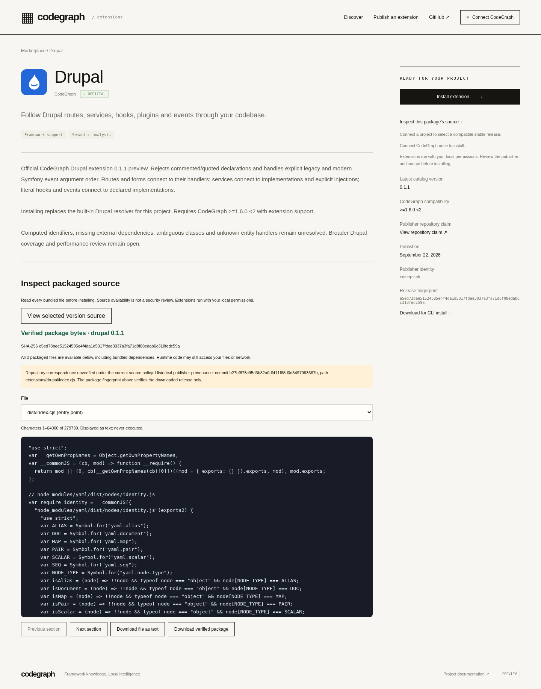

# Marketplace budget and exact source inspection — 2026-09-23

The bounded implementation passes local acceptance. **The new UI and source admission policy are not deployed.** Supported Wrangler access expired and could not refresh; no remote mutation occurred. The existing main and detached restore HTTPS endpoints still report `publishing:false`. General publication stays closed.

Implementation source: `ca6c375993317640f592d1ecc149f5aa48116885`. The later `9f18692f076c0f8311def321856bb31e5f21374c` commit adds documentation, an ignored private rollout config name, and the exact already-tested read-only browser driver; it changes no application behavior. The engine remains `7575dcc71e4524c660aff06486ebc007cca290b9`. Same draft [PR #1911](https://github.com/colbymchenry/codegraph/pull/1911); no merge or release.

## User outcome and cost recommendation

Keep the existing Workers Paid/D1/private R2 preview for the stated **$5/month target**, subject to reviewing shared-account usage. The explicit 30-day model includes 15,000–30,000 downloads, an additional source inspection for every download, six metadata reads and four conservatively charged asset requests per download, and 30 maximum-size uploads. It projects **180,030–360,030 Worker requests and 1,721,370–3,431,370 CPU-ms**, or **1.80–3.60% / 5.74–11.44%** of the existing included request/CPU allowances. No cache benefit is assumed. These are projections from the previous deployed samples, not a load test or new provider measurements.

With enough shared allowances remaining, modeled marketplace usage adds no overage to the existing $5 base. It is **not a hard cap or an account-total promise**. Unrelated applications share allowances, and the accepted telemetry database inventory already exceeded D1's included account storage. R2 operation billing rounds up in whole units; logging, growth, backups, taxes and unrelated charges remain separate. No subscription, account control, paid logging, alert or notification was changed. The [cost model, exact proposed controls and $0 static fallback](../extensions/marketplace-budget-and-source.md) include official pricing links and the owner-only $1 variable-spend alert proposal. No fallback migration or release was performed.

## Implementation and trust boundaries

- The detail page offers inspection before connection or installation. The browser bounds the download to 8 MiB, verifies its immutable SHA-256 and id/version, validates paths/text/file count/entry point, and displays the manifest and every bundled runtime file using inert text. Large files are paged; downloads use the verified in-memory bytes. Bundled dependencies are visible. Nothing is evaluated to display source.
- Inspection is pinned to id/version/digest for the page session. Connecting a destination, compatibility selection, catalog updates and in-flight selection changes cannot silently install a different reviewed release. Pending, failed or stale review blocks review-dependent installation. The installer independently verifies selected identity and package integrity. Inspection is optional and session-local, not a persistent security approval; direct CLI package downloads retain their existing behavior.
- Future hosted publication requires an operator-reviewed public GitHub commit containing the **exact `.cgext` bytes**, bound to publisher identity, extension id, version, digest, repository, revision and path. The signed client cannot assign trusted review/official fields. An empty production approval policy denies all new unreviewed publication. Source failures occur before release/ownership/nonce/object writes; the existing abuse-rate counter may still advance.
- The read-only review CLI uses fixed GitHub API/raw hosts with unauthenticated, bounded, timed, no-redirect requests. It never executes a build or package code. Operator review and a checked policy commit are required afterward. This proves public packaged-byte correspondence at the recorded time, **not** correspondence to separately authored/transpiled sources, a reproducible build, ownership, license compliance or absence of malicious behavior. Availability can change after review. The portable Node publisher remains local/legacy tooling and does not enforce this new hosted policy.
- Drupal 0.1.0 and 0.1.1 keep their exact historical bytes and listings. Their package content is inspectable, while the UI labels repository correspondence as unverified under the new policy. Historical official provenance remains visible. New official versions require the new source proof; the exception is pinned to those two exact Drupal hashes. No live fixture or old metadata was rewritten.

The executable procedure is in [the source policy guide](../extensions/marketplace-budget-and-source.md#future-hosted-publication-contract). The generated real public Drupal review is evidence only: it was not added to the approval policy or written to the registry.

## Validation and scope

The [JSON ledger](extensions-budget-source-20260923.json) records exact command arguments, cwd, source/dirty state, exits, durations and log hashes, plus all raw outputs. Final affected application checks use `ca6c375`; earlier development attempts remain separate. Grouped checks are not an exhaustive security audit.

| Check | Result | What was exercised |
|---|---:|---|
| Source admission | 11 grouped checks | Actual local workerd + D1/R2; explicit approved record; missing, mismatched, spoofed and altered artifact rejection; signature/official/ownership/version integrity; production ignores test approval bindings |
| Source browser | 13 grouped checks | Desktop/mobile; every bundled file; HTML/JS inertness; paging/download equality; three selection races; tamper rejection; real SQLite contribution; throwing update preserves prior graph; disable/remove |
| Worker runtime | 21 checks | Existing local immutability, ownership races, atomic publication, backup/restore, process kills and full-size contract preserved |
| Official importer | 20 checks | Both immutable Drupal versions, exact repeat, collision/failure safety, CLI and local D1/R2; **two remote adapter checks are mocked contracts** |
| Compatibility / CLI | 10 checks / 12 commands | Compatible selection, exact pins, failed updates and real Python graph; expected failing CLI commands are asserted |
| Publisher/browser regression | 15 checks | Signed publishing, form preservation, key/ownership/origin/window boundaries, updates, graph cleanup and mobile layout |
| Deadline / operator guards | 4 / 18 checks | Window expiration and admission/config guards; local only, no provider writes |
| Shared package/marketplace tests | 16 tests in 3 files | Existing package-portability, marketplace and release validation |
| Real public source review | 1 successful command | Unauthenticated GitHub repo + full commit + byte-identical Drupal 0.1.0 package at `d971e06` |
| Read-only HTTPS | 6 grouped checks | Actual main/restore health, actual immutable Drupal bytes; local UI **overlaid only in this headless browser**, legacy provenance warning and desktop/mobile display |
| UI-only rollout dry run | Passed | Same bindings, publishing false, CPU limit and exact previously accepted Worker bundle; no deployment |

Provider denial/private/unavailable/rate-limit/wrong-commit responses in the source admission test are mocked; one separate successful GitHub byte review is real. Existing storage and publisher fixtures explicitly simulate operator approval in the test-only Worker entry point. The production Worker ignores these bindings; the new source tests exercise its denial separately. This adaptation preserves lifecycle assertions without presenting placeholder fixture URLs as verified public repositories.

The source browser checks create actual graph node `/inspected-2.0.0` via the managed installer, then confirm a throwing update preserves it and disable/removal clear contributions. This task did not repeat the previous provider Drupal four-link install, 8 MiB upload, restore, full corpus, full Linux or native matrices. Their original source-specific evidence is reused. Accepted engine source/compiled hashes are unchanged except the explicitly changed changelog and Cloudflare bundle. The earlier 4,577-test Linux result and native results remain at their original revisions, not current-head CI claims.

## Retained attempts and evidence boundaries

Seven top-level command attempts exited 1: two browser module-resolution setup errors; one browser fixture with an invalid contributed node-id prefix; the old Worker assertion expecting publication before the new source gate; one test command naming nonexistent test files; and two supported Cloudflare access reads. Each is retained alongside its correction or concrete access blocker. The final scoped assertions were not weakened to hide a product failure. An initial wrong-directory editing command failed before changing repository files.

The compatibility invocation supplied `COMPATIBILITY_OUTPUT` instead of the driver's `COMPAT_OUTPUT`, so the successful result was first written to its default directory and then copied unchanged into this milestone's evidence. Its copied `failure.json`/`failure.png` are stale September 22 files, not failures from this successful run. The command receipt, fresh result and copied output-location note distinguish them. No accepted raw ledger listed that default compatibility path. Prior accepted evidence is retained.

## Hosted handoff and exact blocker

At `2026-09-23T04:09Z`, [main preview](https://codegraph-marketplace-preview.colby-7d9.workers.dev) and [detached restore](https://codegraph-marketplace-preview-restore-20260922.colby-7d9.workers.dev) both returned `publishing:false`. The downloaded Drupal 0.1.1 package matched `e5ed73bee51524585e4f4da1d5017fdee3037a3fa71d8f08edab6c318fedc59a`. The live app still lacks this source viewer; screenshot overlay acceptance is **not a deployed feature claim**.

The prepared private `wrangler.source-ui.json` uses the accepted archived Worker bundle, SHA-256 `43dc01b6bd20160381d409c80ecd4f447ab6539a34890110e6dcad6684060561`, unchanged byte-for-byte in the successful dry run. It changes only static UI assets and keeps the existing dedicated D1/R2 targets, publishing false, 1,000 ms CPU limit, direct static asset routing and observability settings. The future admission gate is intentionally excluded from this UI-only rollout. The exact private config hash and plan are in the ledger/raw archive.

**Blocker:** `wrangler whoami` reports “Your auth token has expired and could not be refreshed.” This task prohibits duplicate login or credential inspection. Klaus must restore the supported OAuth session, then verify account and latest deployment/bindings before applying the saved UI-only plan. No remote deploy/import/publish/storage/account mutation was attempted. General publication remains disabled until a separately reviewed policy deployment and approval.

The $5 target remains conditional on shared usage; the previous full 8 MiB upload consumed 379 ms on Paid and does not fit Free's 10 ms CPU budget. Peak memory/concurrent load, independent retention/RPO/RTO, pagination past 1,000, custom domain and release/fixture cleanup remain open. Semantic callback skipping remains a no-go; no new optimization work was performed.

## Inspected screenshots

Local fixture on desktop; operator approval is explicitly simulated by the test policy:

Local mobile source inspection:

Actual HTTPS Drupal data with the tested UI overlaid in this browser only; unchanged hosted provenance is correctly marked unverified:

