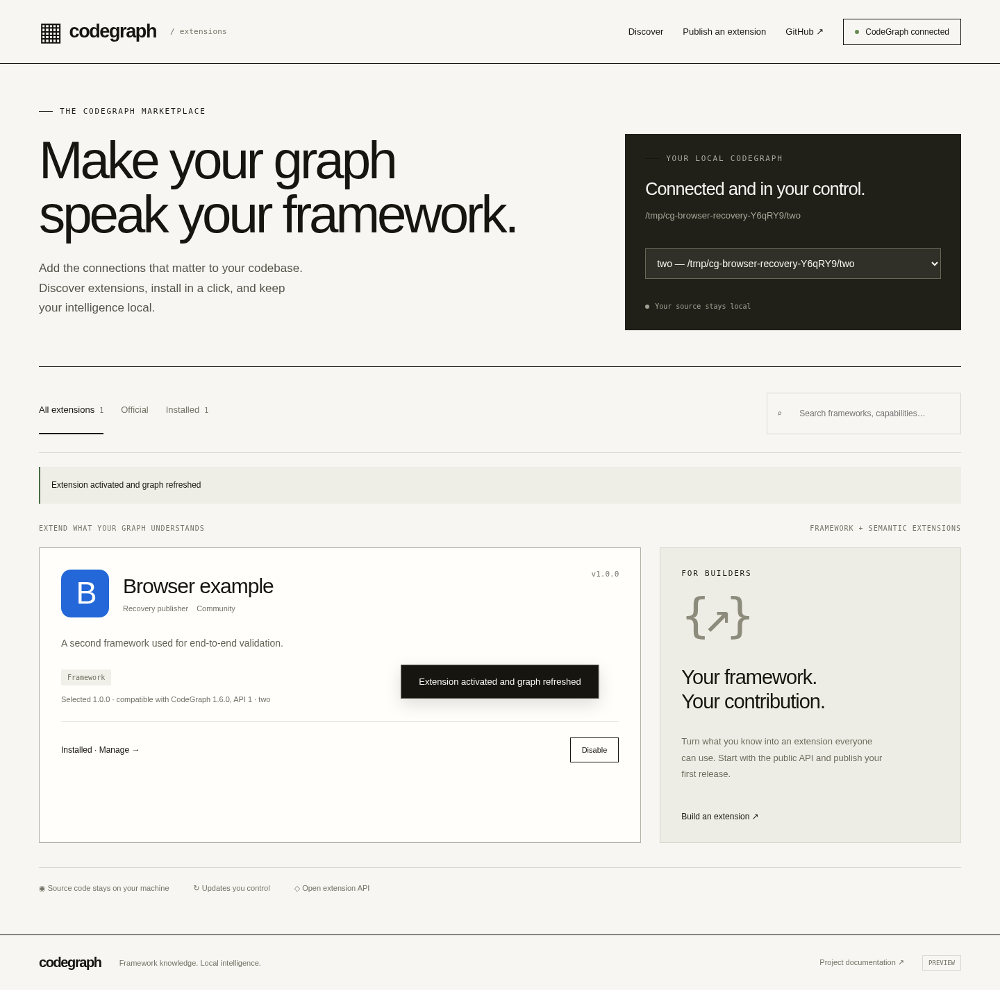
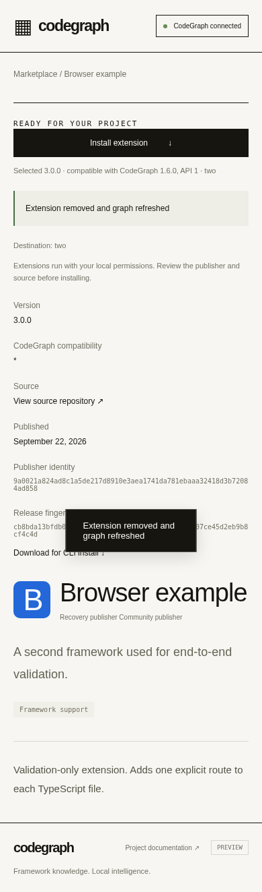

# Cloudflare registry preparation and local runtime acceptance — September 22, 2026

Cloudflare is the preferred marketplace host. This increment continues PR [#1911](https://github.com/colbymchenry/codegraph/pull/1911), preserves the accepted portable registry, and supplies a separate Worker/D1/R2 implementation. **No Cloudflare deployment, durable public URL, account resources or custom domain are verified.** The implementation and local acceptance are reviewable; hosted acceptance remains blocked.

## Source and reproducibility

Checkout: `/data/workspace/Chats/109197f0a288be0afa6b7f8902925630f5a0bfde/codegraph`, branch `feature/extensions-author-kit-20260922`.

- Prior accepted portable hosting commit: `160f4685eafc6a7e54847b5501435ea5da073fb3`.
- Recovered Worker checkpoint: `44aaa721b2206af68c2ed99a96a4c9f7eabf1bef`.
- Worker/application source tested: **`52c1b38644e9c0833945ceabaa086ecbbd4aac57`**.
- Final operator tooling source: **`e77f011ec34c14150a805bb41e2a06c2a9efad3d`**. This changes only local backup initialization, its subprocess test, and the guide. Production Worker, migration, frontend, shared validator and core engine are identical to `52c1b38`.
- Subsequent changes in this increment are documentation/evidence only. Final remote head and Git tree readback are recorded in the chat recovery checkpoint.

[Evidence ledger](extensions-cloudflare-20260922.json) preserves exact source/compiled hashes, command/revision/exit receipts, child signals, raw file hashes and GitHub artifact summaries. [Deployment guide](../extensions/cloudflare-hosting.md) contains runnable local, dry-run and operator commands, migration/config, access requirements and remote verification steps. No secrets or production packages were used.

## Implemented contract

Workers Static Assets serves the marketplace; the Worker API uses Web Crypto P-256 signatures, SPKI publisher identity and the portable package validator also used by Node. D1 holds identity/schema, ownership, immutable release metadata and replay nonces. A private R2 bucket holds content-addressed package bytes. Native SQLite and Node filesystem APIs are absent from the Worker bundle.

A conditional, checksum-verified R2 write precedes one transactional D1 batch for ownership, version and nonce. Failures before the D1 commit expose no release. A lost response after commit leaves an immutable release; catalog refresh identifies the outcome. Failed publications may leave unlisted R2 objects, which cannot be downloaded through the public API. There is no concurrent garbage collector. D1 constraints/triggers resolve competing publishers and prevent mutable versions. Missing or corrupt R2 bytes fail closed. The trusted local installer independently revalidates downloaded packages.

Publishing defaults to disabled. Requests are bounded to an 8 MiB package / 12 MiB signed envelope. A D1 limiter permits ten submissions per IP/minute; the preview catalog caps at 1,000 releases. These are safeguards, not a spending ceiling. Asset and API security policies retain same-origin publisher and local companion restrictions.

The local backup rehearsal takes a consistent D1 batch snapshot plus referenced immutable R2 bytes. It validates package/metadata/ownership correspondence, writes the completion manifest last, and restores objects before publishing metadata into a detached empty target. The operator CLI refuses missing/uninitialized sources and existing restore destinations. Remote backups are documented but have not run against a Cloudflare account.

## Final local results

Local Worker execution is real `workerd` through Miniflare with D1/R2 bindings and persisted state; no in-memory JavaScript database mocks. Node 22.23.2, Linux x64, Chrome 153.0.8010.36. Wrangler 4.136.1 and Miniflare 5.20260921.0-alpha are pinned in the separate lockfile. Local execution is not a claim about deployed CPU limits or provider durability.

| Check | Source | Result / receipt |
|---|---|---|
| Worker crypto/storage/consistency matrix | `52c1b38` | **21 passed**, exit 0; `.qa/recovery/cloudflare-runtime-final.json` |
| Shared package, marketplace, author, compatibility, trust and storage regression | `52c1b38` | **35 tests / 7 files passed**, exit 0; `cloudflare-focused-final.json` |
| Worker browser publisher/lifecycle/boundary checks | `52c1b38` | **15 passed**, exit 0; `cloudflare-browser-final.json` |
| Worker browser + headless compatible release selection | `e77f011` | **9 passed / 12 CLI receipts**, exit 0; `cloudflare-compatibility-final.json` |
| Documented offline backup/restore CLI | `e77f011` | **5 passed / 6 subprocess receipts**, exit 0; `cloudflare-operators-final.json` |
| Wrangler deployment dry run | `e77f011` | Exit 0; **147.60 KiB / gzip 27.93 KiB**, four static files, D1/R2/ASSETS bindings, publication false; `cloudflare-dryrun-final.json` |
| Supported authentication read | `e77f011` | `wrangler whoami` reports **not authenticated**; exit 0 is not an authenticated result; `cloudflare-access-final.json` |

The runtime matrix verifies Node/Worker signature identity, byte-identical downloads, ownership and replay protection, malformed/signature/API rejection, cross-origin rejection, R2 boundary failures, a real database-trigger abort after upload, transactional rollback, concurrent version/owner races, lost commit responses, backup/isolated restore, corruption refusal and replacement-runtime persistence. It also verifies disabled publishing and that production ignores test-only fault headers.

Maximum-size acceptance remained **8,388,608 bytes**. An exact-size signed package was uploaded and three independent HTTP downloads matched its digest; the next byte was rejected. No reduced payload, automatic retry or skipped assertion made this pass. The recorded publication wall time was approximately **917 ms locally**, including I/O; this is **not Cloudflare CPU time or Free-plan eligibility evidence**.

Two isolated test-owned Node/Miniflare children were killed with **SIGKILL** after the R2 write and after the D1 commit. Fresh runtimes saw, respectively, no listed/downloadable release with a retryable submission, or the committed byte-valid release with replay rejected. Child exit/signals and logs are preserved. No shared service was killed. This demonstrates application process-death recovery, not power-loss or a diagnosis of prior Hoblets interruptions.

The browser selected the highest compatible stable version despite out-of-order publication, newer incompatible and preview versions. A single Install after connection refreshed the selected Python project's actual SQLite graph. CLI selection, incompatible exact pins, no-compatible failures, prerelease pins, no silent downgrade, failed-update rollback, file/URL semantics, build-metadata pins and removal all passed. Separate browser checks exercised real signed publication, owner/signature/malformed rejection, delayed publisher-form responses, update/disable/enable/remove, wrong-origin/window messages, closed companion and stopped registry failure states. Desktop/mobile captures were inspected:

## Native and HTTPS regression: separate backend scope

Automatic [native run 35697507959](https://github.com/colbymchenry/codegraph/actions/runs/35697507959) passed at `52c1b38`: actual Windows Server 2022 x64 **141 focused passes / 4 skips**, macOS 15 ARM64 **144 / 1**. Each also passed 13 portable SQLite storage checks, 9 external-author checks, 9 compatibility checks/12 CLI receipts, 15 browser checks and both builds. Raw artifact log hashes match the stored summaries. These are **Node-backend regression results**, not deployed Cloudflare or native workerd coverage. Unchanged lifecycle/worker/path matrices were explicitly reused.

Automatic [HTTPS run 35697507943](https://github.com/colbymchenry/codegraph/actions/runs/35697507943) passed at `52c1b38`: builds, **9 compatibility checks/12 CLI receipts and 15 browser checks** over real temporary public HTTPS. This closes the earlier portable Node publisher-HTTPS gap on this source. It uses the **Node backend through a temporary tunnel**, not a hosted Cloudflare Worker or persistent provider resource. Test tunnels were closed.

The local Worker-specific HTTPS attempt and its permitted network retry both failed with **`getaddrinfo ENOTFOUND`** for temporary tunnel hostnames, after the initial health probe but before compatibility acceptance. Receipts `cloudflare-https-compatibility.json` and `cloudflare-https-compatibility-network-retry.json` preserve exact errors, revisions, times and exits. **No Worker-specific public HTTPS pass is claimed.** The HTTP Worker runs above remain distinct.

The operator fix also triggered [native run 35725244066](https://github.com/colbymchenry/codegraph/actions/runs/35725244066) and [Node HTTPS run 35725244163](https://github.com/colbymchenry/codegraph/actions/runs/35725244163) at `e77f011`. Both completed successfully with the same scope/counts; their artifacts and log hashes are included in the ledger. No manual rerun of unaffected corpus/core suites was requested.

## Preserved failures and recovery limits

The interrupted `cloudflare-runtime-third` run passed fourteen cases then failed downloading the 8 MiB package with `ECONNRESET`. It did not establish over-limit, rate-limit or process-kill results. The old receipt/log and copied failure JSON remain in the archive. An isolated diagnostic at `44aaa72` subsequently published/downloaded the full 8 MiB artifact through three transport paths. The harness now closes completed fixture runtimes before the maximum-size and process-kill cases and writes a checkpoint after every passed case. Final checks above passed; the earlier reset's underlying cause is **not conclusively identified**.

An earlier browser/CLI attempt overlapping TypeScript compilation failed on a third publication with a socket close. Its failure is retained; the sequential run and final committed-source run passed without automatic retry. This is not a stress/load-test pass. Initial Miniflare API/persistence-option errors and the corrected deployment dry run are also retained, not represented as successful attempts.

## Remaining access, cost and delivery gates

1. **Account/deployment access:** latest supported Wrangler read is unauthenticated. Klaus owns the pending Cloudflare browser handback; this task did not touch that browser, request a duplicate login, inspect secrets or create a temporary account. Browser sign-in alone will not establish Wrangler/API access.
2. **Resources:** inspect the actual account/plan, authorized existing preview Worker, D1 database and private R2 Standard bucket. The checked-in D1 ID is a placeholder. No provider resource has been created/activated, no paid plan selected, and no remote migration run. R2 activation or usage may be billable and requires authorization.
3. **Stable HTTPS and hostname:** `marketplace.getcodegraph.com` is proposed, not verified/configured. Verify zone/hostname authority and deploy a reviewed preview only after access/resource approval. Complete Worker-specific HTTPS connect → one Install → actual graph, publisher/manage/origin/outage flows there. No durable URL is available.
4. **Provider persistence/backup:** replace deployed Worker code with unchanged D1/R2 bindings and verify identity/ownership/bytes; execute export and isolated restore into a separate authorized pair, including independent archive retention. Local replacement and backup tests do not satisfy these hosted gates. RPO/RTO, off-host retention, power loss and multi-region behavior remain unmeasured.
5. **CPU/scale:** illustrative demand of 300 releases × 500 KiB, 4,000 catalog queries/day and 1,000 downloads/day is below published request/row/storage allowances in isolation. It is an assumption, not measured demand or a bill estimate. Free Workers' 10 ms CPU/invocation remains unproven for maximum packages. Measure deployed CPU/memory and account-wide usage before choosing a plan; do not silently lower the package limit or enable paid resources. See [cost model and official sources](../extensions/cloudflare-hosting.md#costs-and-limits-planning-assumptions-not-a-bill-estimate).
6. **Product scope:** official Drupal import needs a reviewed operator path; the community Worker API cannot self-assign official status. Catalog pagination beyond the preview cap, orphan cleanup, stronger abuse controls, additional browser/OS combinations and production scale remain outside this proof. Broader Drupal accuracy/performance review remains open; historical **22–30% rebuild overhead** is retained.

The prior 4,564-pass / 192-skipped whole Linux suite applies to `37d4dd8`, before later hosting work; it is not a current whole-suite claim. Previously accepted Drupal corpus and native lifecycle evidence are preserved. No merge, release, npm publication, Vercel deployment, DNS/account/shared-runtime change, paid activation, extra model session or contributor announcement occurred.
