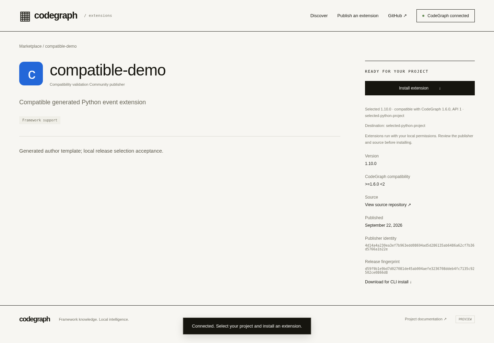
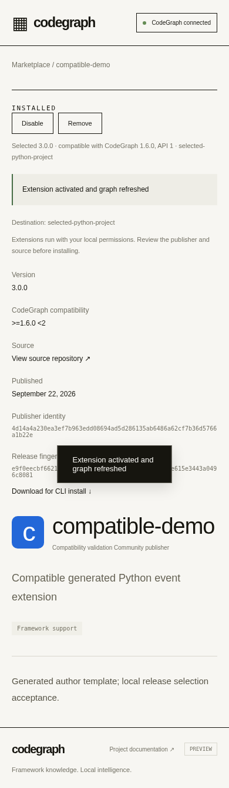

# Compatible extension release acceptance — 2026-09-22

Scoped milestone on draft PR [#1911](https://github.com/colbymchenry/codegraph/pull/1911),
branch `feature/extensions-author-kit-20260922`. Source commits
`eab93c311434e1a5878c680a52b8c072da5ff772` and
`79f2d9f1cab2e19ad35fb99f4e215da8f9d5fdfa`. The latter is the clean revision used
by all final runtime/browser/focused checks. Subsequent evidence changes only
documentation. No merge, release, public npm publication or hosted deployment.

## Behavior

`src/plugins/releases.ts` provides one semantic-version selection policy. The
managed installer resolves using its own engine version and supported manifest
API, never a browser-supplied engine claim. Browser `resolve` and registry
install/update commands use that installer. The CLI opts into the same path with
`--registry`; an unqualified file or URL still means an exact artifact.

Automatic selection chooses the highest compatible stable version regardless
of publication order. Invalid metadata, unsupported/missing API markers and
incompatible ranges are excluded. Prereleases require an explicit exact
`--version` pin, which never falls back. Automatic selection cannot downgrade
an installed version; that guard is also checked under the operation lock.
Exact pins may intentionally select an older compatible version. Equal semver
precedence (build metadata) has a deterministic lexical tie break.

The catalog includes API metadata and sorts stable versions semantically before
previews; historical stored listings recover their API marker from immutable
package bytes. The browser shows the actual selected version, running engine,
API and destination. Selection is refreshed on connection, destination changes,
publication and installed-state changes. Installation binds the displayed version
and digest, resolves again locally, then checks the downloaded identity/version,
engine/API manifest and SHA-256 digest before changing configuration or graph.
A selection changed since display requires a refresh. No compatible release and
failed activation preserve the current configuration and graph.

The original publisher identity, immutable release, bearer, local-host, origin
and window restrictions remain in force. Existing exact URL bridge commands
retain their pinned-artifact semantics.

## Reproduction and receipts

From this checkout, with installed development dependencies:

```sh
npm run build
npx vitest run __tests__/extension-releases.test.ts __tests__/extension-marketplace.test.ts __tests__/extension-author.test.ts __tests__/plugins.test.ts __tests__/extension-explore.test.ts __tests__/npm-sdk.test.ts __tests__/cli-install-init.test.ts __tests__/cli-version.test.ts --maxWorkers=2 --minWorkers=1
node --test scripts/validation/extensions-runtime.test.cjs
PLAYWRIGHT_MODULE=/absolute/path/to/playwright COMPAT_OUTPUT=.qa/recovery/compatibility-verified node scripts/validation/extensions-compatibility.cjs
PLAYWRIGHT_MODULE=/absolute/path/to/playwright BROWSER_OUTPUT=.qa/recovery/compat-browser-regression node scripts/validation/marketplace-browser.cjs
```

The browser scripts use local registries and Chrome (`/opt/google/chrome/chrome`)
on Linux. No paid resources or extra model sessions were used. This report's
[JSON receipt](extensions-compatibility-20260922.json) includes exact commands,
source hashes, exits, timestamps, durations, raw log hashes and every headless
subcommand's exit/log hash. Raw receipts/logs are under `.qa/recovery/` in the
saved checkout; output overrides keep earlier evidence intact.

| Check | Result | Duration |
|---|---|---:|
| Final engine/assets/viewer build | exit 0 | 32.724 s |
| Focused installer/registry/author/runtime/retrieval/SDK/CLI tests | 8 files, 43 tests passed; exit 0 | 18.087 s |
| Compiled worker lifecycle, isolation and rollback | 2 tests passed; exit 0 | 7.520 s |
| Generated-extension browser/headless compatibility matrix | 9 acceptance checks, 11 CLI subprocess receipts; exit 0 | 24.301 s |
| Existing publisher/lifecycle/connection browser regression | 11 checks; exit 0 | 14.119 s |

The build ran with the four changes later committed in `79f2d9f` still dirty;
its source bytes match that commit. Final focused, worker and both browser runs
used clean `79f2d9f`. The earlier first matrix attempt at `eab93c3` failed:
root `--version` swallowed an extension pin and printed `1.6.0` with exit 0.
Scoped positional parsing and a CLI regression test fixed this real failure.
That failed receipt/log remains `.qa/recovery/compat-e2e.{json,log}`; it is not
counted as passing evidence. Execution completed without task interruption.

## Acceptance observations

- Signed immutable releases were published in this order: `1.10.0`, `1.9.0`,
  `0.5.0`, `20.0.0-beta.1`, `9.0.0` (requires engine `>=9`). The actual engine
  is `1.6.0`, API 1. One browser Install after connection selected `1.10.0`.
  Publication order and preview precedence did not override compatibility.
- The selected destination was a second Python project without `package.json`.
  Its real graph contained `event:order.created → send_receipt`, with the
  version-specific `Python event dispatch 1.10.0` edge label. The first
  connected project had no extension contribution.
- An extension having only an engine `>=9` release produced a useful failure,
  disabled Install, and preserved existing config and graph. Direct bridge
  commands and the CLI also failed without mutation.
- Headless automatic installation selected the same `1.10.0`. Exact `9.0.0`
  failed with a compatibility error; no version was substituted. Updating a
  missing ID also failed.
- Explicit `20.0.0-beta.1` installed only when pinned. Automatic update from
  that preview refused a downgrade and preserved config/graph. An explicit
  `1.9.0` pin then selected exactly that lower version.
- A compatible but broken `2.0.0` update failed activation and retained
  `1.10.0` and its graph. A valid `3.0.0` update succeeded in browser and CLI,
  removed stale version labels and still skipped incompatible `9.0.0`.
- Exact artifact URL `1.9.0` and local file `1.10.0` installations remained
  exact. Removal cleared their graph contributions.
- Unit checks reject wrong downloaded IDs/versions, unsupported APIs,
  incompatible actual manifests, integrity mismatches, duplicate catalog
  versions and stale preview bindings. They exercise disjoint engine ranges,
  prerelease engine semantics, invalid catalog data and the under-lock
  no-downgrade guard.
- The retained browser regression passed signed form publication, ownership,
  invalid-signature/malformed-package failure states, selected-project install,
  update rollback, stale cleanup, disable/enable/remove and real wrong-window/
  wrong-origin postMessage rejection. No browser page errors were recorded.

Desktop and mobile screenshots were visually inspected; selected version,
compatibility and destination are visible and the mobile viewport does not
scroll horizontally. The capture includes local validation-only publisher data.





## Remaining gates

This closes compatible registry resolution for the Linux/local preview, not
full product completion. Next bounded step: process-kill and stale-lock recovery,
including interrupted configuration/database transitions. Actual Windows/macOS,
hosted HTTPS-to-loopback acceptance, durable registry SQLite/artifact storage,
backup/restart checks and Vercel integration remain unverified.

Drupal extraction/runtime source and the three-corpus evidence were unchanged
and reused: nine selected flow probes, deterministic rebuild and incremental
convergence; Express control graph unchanged. Drupal rebuild overhead remains
**22–30%** versus built-in in the measured runs, with limited samples and coverage.
No exhaustive precision/recall or agent A/B claim is made. Author-kit acceptance
at `8b30afb` remains separate from this generated-template compatibility matrix.
The **4,545 passed / 192 skipped** suite at `07b0a10` predates both later milestones
and is not a current whole-suite result. No hosted CI pass is claimed.

Code-complete: full product partial. Validated: this Linux/local milestone passed.
Hosted preview-ready: unverified. Released: no.
