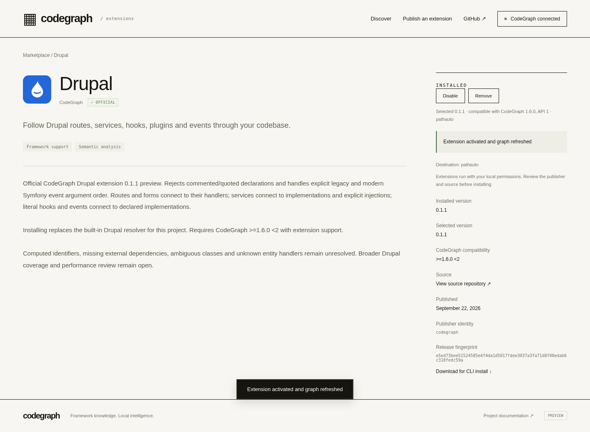
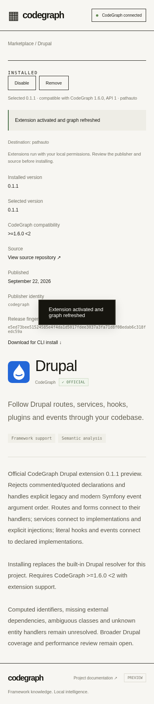
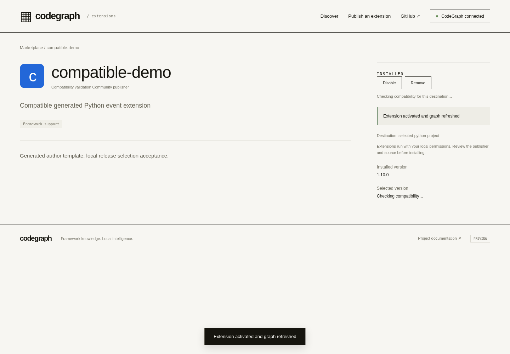

# Drupal accuracy, performance and integrated regression — 2026-09-22

Draft PR [#1911](https://github.com/colbymchenry/codegraph/pull/1911). Product remains a preview; no merge, npm release, deployment or remote official import occurred. Cloudflare access remains with Klaus/the user.

## Source and changes

Final application/test source: `8936a3dc4353284dd15ad6ba2699c930a15aebcc`. Drupal/UI implementation is `b27bf875c95d3b82a0df411f68d0d8497993667b`; official policy is `7e674aa0fa7dc6603dcabbedaf5f0856c06f24b4`. Corpus/profile harnesses are `e72c064` and `2bc4029`. Later report changes are documentation/evidence only. The accompanying JSON records source/compiled/raw hashes and every command/revision/exit, including failed attempts.

Drupal 0.1.1 rejects `NotDrupal::service`, commented subscriber registrations/hook attributes/constants and quoted plugin annotations carried from an earlier class. It recognizes both explicit Symfony event argument orders, including nested commas in event constructor arguments. Per-file masked source and line offsets are reused, and the former repeated preceding-node scan is removed. These changes fix observed correctness defects; the profiling below does not establish a speedup.

The marketplace keeps installed version distinct from selected compatibility metadata. A held resolve response now shows installed `1.10.0` and selected `Checking compatibility…`, with no incorrect release download/fingerprint. The retained pre-fix screenshot showed installed status beside catalog version `9.0.0`.

A stronger incremental fixture exposed a separate core defect: scoped sync skipped whole-graph semantic passes. Adding a dispatcher/subscriber produced no link; full rebuild did. API v1 has no semantic dependency/invalidation contract, so changed semantic-extension projects now use the existing atomic candidate rebuild, including explicit `indexFiles`. Scoped paths do not bound that global candidate. A real failing pass preserves the previous graph and fails the request; changed metadata retargets links between untouched endpoints, deletion removes them, and a healthy unchanged project does not rebuild. **This is a correctness fallback with full-rebuild latency, not a fine-grained incremental implementation.** A dependency/invalidation API and incremental performance work remain open. Earlier installer kill matrices are retained; no new claim of a process-kill matrix for this sync fallback is made.

## Immutable artifacts

[Operator guide](../extensions/official-drupal-import.md) and policy retain 0.1.0 unchanged: 289,167 bytes, SHA-256 `e5015747d02fe50d6af607b6c44f1db9cf7969a0070866ed03c7643377a459c8`, source `37d4dd8`. Archived bytes are tracked under `extensions/drupal/releases/` and copied unchanged by the build.

0.1.1 is a distinct 291,889-byte package: SHA-256 `e5ed73bee51524585e4f4da1d5017fdee3037a3fa71d8f08edab6c318fedc59a`, reviewed source `b27bf875c95d3b82a0df411f68d0d8497993667b`. `dist/extensions/drupal.cgext` and `drupal-0.1.1.cgext` contain that version. The operator matrix imports/repeats both versions together without mutating either. No public publication took place.

## Accuracy scope

28 exact source/target/path/label assertions, four source-grounded unresolved cases, nine labelled explore flows, and duplicate-key checks pass. Each positive stores SHA-256 and a source excerpt for caller, target and wiring registration. Whole edge counts below are inventory, not individually certified accuracy or precision/recall percentages. Two synthetic test groups additionally cover valid routes, DI, hooks, plugin IDs and events plus comments, strings, computed IDs, missing classes, cyclic aliases and ambiguous plugin IDs.

| Pinned corpus | Indexed files | External nodes / edges / plugin edges | Exact links / negatives / flows |
|---|---:|---:|---:|
| pathauto | 89 | 1102 / 1866 / 65 | 9 / 2 / 3 |
| commerce | 1230 | 12190 / 26979 / 428 | 9 / 1 / 3 |
| drupal | 6728 | 64427 / 156872 / 4258 | 10 / 1 / 3 |

Pins and input manifests:

- pathauto: `b97aadf47a37cff25f7d6105c3dade6778fccb47`. Both arms have identical tracked-source aggregate hash `23499479dde671d49ff5e51037df38319ef4beed3af80fd84469daff25535e40`.
- commerce: `643bb39620c083f6d52acd41c8170d7f34b40e1c`. Both arms have identical tracked-source aggregate hash `e70f0045d36e6851da4b9e642309247a2e59506aee670847f84734ec56f6629a`.
- drupal: `eaba66f418831210acc6bc5b49c61d171853455b`. Both arms have identical tracked-source aggregate hash `f7e5e16bec6c51e9c88d7db54858f6c48b03bc16a49d7aaf0bd93bb7f964f6cb`.
- express: `9a34acf03cb818ff3f8bc40e44176e277a25cbb9`. Both arms have identical tracked-source aggregate hash `4169ca4faca74b39a4f380441ab5675700de24abfc1dee98fdd7a66e1a8c4475`.

Drupal core excludes `**/tests/**` in both arms, matching the earlier 6,728-file corpus scope. Pathauto/Commerce keep their fixtures. An early diagnostic accidentally indexed 14,506 Drupal files including tests; it is retained but excluded from comparisons. All ordinary PHP nodes match exactly between built-in and external arms. Each of the 24 rebuild samples reproduces its arm's canonical graph hash. The Express control has identical complete graphs with zero Drupal edges. Canonical snapshots omit update timestamps and database edge row IDs only.

After the sync fix, all three corpora pass add → full rebuild → remove convergence with a newly added legacy event dispatch/subscriber pair and an unknown route. Added event links must exist; the unknown controller must stay unresolved; full graph hashes must match after rebuild and return to the original on removal. Existing final graph hashes therefore preserve the earlier 28 grounded assertions.

Limitations: sampled explicit forms, not full Drupal runtime semantics. Dynamic entity forms, container factories/decorators/autowiring, computed IDs/names, single-argument object event inference, grouped imports and multi-namespace files are not certified. Method receiver matching is heuristic, not PHP runtime type analysis. No screen navigation or PHP branch guards. Repository agent A/B sessions were not run because this task explicitly prohibits extra model sessions; no agent efficacy claim is made.

## Repeated performance

Same pinned sources/settings/current engine: Node 22.23.2 Linux x64, parse workers 2, resolver workers 0, telemetry off. Each sample starts a fresh process on an already indexed disposable copy and calls `refreshPluginIndex`, including opening/closing the graph. The canonical snapshot is outside wall/CPU timing. OS caches are warm/uncontrolled; no shared cache or host configuration was changed. Three paired runs per arm; ordering alternates built-in/external then external/built-in. No other heavy local validation was launched during the matrix; shared-host contention remains possible. RSS is process high-water RSS and CPU is process user+system time, not fleet or Cloudflare CPU.

Measurements ran at e72c064/2bc4029 (some early receipts include only uncommitted harness/docs). 8936a3d changes sync/indexFiles, not the measured refresh/indexAll path or artifact. Results are reused with that explicit equivalence, not relabelled as timings executed at 8936a3d. The final convergence rebuild verifies the same canonical graphs at 8936a3d.

| Corpus | Built-in wall samples (s) | External wall samples (s) | Median delta | Built-in / external median CPU (s) | Built-in / external RSS range (MiB) |
|---|---|---|---:|---|---|
| pathauto | 2.143, 2.144, 2.065 | 2.378, 2.218, 2.186 | +3.50% | 3.015 / 3.280 | 185.2–188.7 / 190.6–193.4 |
| commerce | 14.315, 13.374, 13.536 | 15.400, 14.077, 14.607 | +7.91% | 19.519 / 20.846 | 335.8–345.0 / 349.4–353.4 |
| drupal | 103.620, 98.111, 115.247 | 98.371, 114.315, 103.641 | +0.02% | 107.739 / 117.941 | 916.9–954.6 / 917.2–949.8 |
| express | 3.316, 3.197, 3.315 | 3.338, 3.029, 3.343 | +0.69% | 4.818 / 4.781 | 187.2–192.3 / 188.0–191.8 |

Historical **22–30% rebuild overhead** remains an observed, limited-sample result from the earlier run. It is not reproduced as a constant wall-time penalty in this paired matrix: Drupal medians are 103.620s and 103.641s, with broad overlapping 98–115s ranges. External median CPU remains about 9.5% higher. Pathauto/Commerce show +3.5%/+7.9% median wall cost; Express +0.7% is smaller than its observed spread, not proof of zero overhead or a universal no-regression guarantee. No statistical confidence interval/SLA is claimed from n=3.

Large-corpus phase medians: built-in parse loop 33.187s vs external 35.848s; resolution 31.598s vs 37.423s. The external wiring callback contributes about 4.323s; callback synthesis is a nested part of resolution, not additive to it. Other resolver/synthesis passes and I/O account for the rest. The `dedupe-merge` diagnostic includes elapsed pass time due its timer scope and is not summed as an independent phase. The external graph also provides additional services/plugins/semantic links, so the two arms do different useful work.

A separate callback-only diagnostic executes 0.1.0 and 0.1.1 three times over the SAME preloaded source/node snapshot. It excludes extraction, persistence, worker isolation and context setup. Outputs intentionally differ because correctness changed; each version's output is deterministic. This diagnostic must not be mistaken for an old-vs-new whole-engine benchmark.

- 0.1.0: wall [2.236, 1.86, 1.976]s; CPU [3.074, 2.263, 2.254]s; 4422 raw callback edges.
- 0.1.1: wall [2.317, 2.075, 1.751]s; CPU [3.125, 2.622, 1.886]s; 4429 raw callback edges.

The new callback's median is worse in this diagnostic (roughly +5% wall/+16% CPU); cached masking/offset work does not justify a speedup claim. Correctness improvements remain, and further measured optimization is open. Initial installation timings and the all-files diagnostic are separately receipted, not mixed into the rebuild medians. Source mutation sync now has full-rebuild cost; its exact add/rebuild/remove elapsed times are in the convergence records.

## Integrated validation

Full Linux regression at `8936a3dc4353284dd15ad6ba2699c930a15aebcc`: **4574 passed, 192 skipped, 0 failed**, all **283 files exactly once**, no missing/duplicate/unexpected files. Four separately completed shards with exact commands, exits, report/log digests and checkpoint receipts. This supersedes, rather than reuses, the historical 4,564-test result for whole-suite coverage.

| Shard | Passed | Skipped | Exit |
|---|---:|---:|---:|
| 1 | 1696 | 63 | 0 |
| 2 | 1133 | 56 | 0 |
| 3 | 855 | 23 | 0 |
| 4 | 890 | 50 | 0 |

Local final source: 20 operator checks (two mocked remote-transport contracts), 21 workerd/D1/R2 checks, 8 official Drupal browser checkpoints, 10 compatibility checks/12 CLI receipts, 15 browser regressions, two compiled-worker tests and two Drupal fixture tests. Build receipts are retained. The official browser performs one connection/one Install of 0.1.1, verifies four real Pathauto links, preserves the graph after malformed/incompatible/tampered failures and clears/restores contributions through disable/enable/remove. Desktop/mobile and pending-version screenshots were inspected. Broader 28-link proof remains the separate corpus check.







Native final run: [35734756331](https://github.com/colbymchenry/codegraph/actions/runs/35734756331) at 8936a3d. Actual Windows 2022 x64: **142 focused tests passed, four platform skips**. macOS 15 ARM64: **145 passed, one Windows-only skip**. The ledger retains step/log hashes. Each includes the real semantic-sync failure/retarget fixture, Drupal package fixtures, author, compatibility, persistence and browser checks. Unchanged core lifecycle/native-path/70-kill matrices were retained from accepted evidence and not rerun. Other OS/architecture/browser combinations remain untested.

Earlier run [35732408208](https://github.com/colbymchenry/codegraph/actions/runs/35732408208) at e72c064 passed before the sync fix and is separately retained. Temporary Node-backend HTTPS [35732408069](https://github.com/colbymchenry/codegraph/actions/runs/35732408069) at e72c064 passed ten compatibility and 15 browser checks on the same frontend/registry/installer paths. It does not test the new sync fallback or prove Cloudflare hosting. Earlier DNS failures remain historical evidence; no repeated job was launched just to chase a green badge.

## Reproduction and retained failures

Build: `npm ci --no-audit --no-fund`, `npm run build`, `node scripts/build-extensions.mjs`, `npm run build --prefix marketplace`, `npm ci --prefix marketplace/cloudflare --no-audit --no-fund`, `npm run build --prefix marketplace/cloudflare`.

Create disposable copies with `git -C PINNED_SOURCE archive PIN | tar -x -C NEW_COPY`; use the pins above. Set core's `codegraph.json` to `{ "exclude": ["**/tests/**"] }` in BOTH arms before first index. For each arm use:

```sh
node scripts/validation/drupal-review-sample.cjs COPY builtin first OUT.json
node scripts/validation/drupal-review-sample.cjs COPY external first OUT.json
# Separate copies; only select one mode per command/copy.
node scripts/validation/drupal-review-sample.cjs COPY MODE rebuild SAMPLE.json
node scripts/validation/drupal-review-probes.cjs CORPUS EXTERNAL_COPY PROBES.json
node scripts/validation/drupal-review-incremental.cjs EXTERNAL_COPY add CONVERGENCE.json
node scripts/validation/drupal-review-incremental.cjs EXTERNAL_COPY rebuild CONVERGENCE.json
node scripts/validation/drupal-review-incremental.cjs EXTERNAL_COPY remove CONVERGENCE.json
node scripts/validation/drupal-pass-profile.cjs DRUPAL_EXTERNAL_COPY PROFILE.json
node --test scripts/validation/drupal-accuracy.test.cjs scripts/validation/drupal-negative.test.cjs
```

Operator: `cd marketplace/cloudflare && node official-test.mjs`. Official browser: `PLAYWRIGHT_MODULE=PATH_TO_PLAYWRIGHT node scripts/validation/cloudflare-official-drupal.cjs` with `PATHAUTO_CORPUS` pointing at the pinned checkout. Worker regressions use `CLOUDFLARE_REGISTRY=1` with the existing compatibility/browser scripts. Current full suite: four `node node_modules/vitest/vitest.mjs run --shard=N/4 --maxWorkers=2 --minWorkers=1 --reporter=default --reporter=json --outputFile.json=NEW_FILE` commands. Do not overwrite receipts.

Retained failures: original Drupal false-positive fixture; missing legacy event fixture; transient metadata pre-fix screenshot/timeout; uncomparable all-files initial profile; real scoped-sync convergence failure (and diagnostic full rebuild success); initial generic sync test-harness mistake (wrong node kind/name and framework-only starter, corrected to a semantic pass with real failure). No failed assertion was removed to certify the package. The final scoped/full graph assertions and all version/trust/failure checks remain strict.

## Remaining gates

Cloudflare login has no explicit handback. No credentials, resources, domain/DNS or remote import were touched. Wrangler/API account access, authorized Worker/D1/private R2 resources, stable Worker HTTPS, provider redeploy persistence, remote backup/isolated restore/retention and deployed Free-plan CPU fit remain unverified. `marketplace.getcodegraph.com` is proposed/unconfigured. Local full-package/runtime timing is not Workers billed CPU and cannot establish the Free 10 ms budget. No paid resources activated. Native and temporary HTTPS success use the separate Node backend.

Next bounded engineering step: review the semantic-sync full-rebuild tradeoff and design measured invalidation before claiming low-cost incremental support; complete actual Cloudflare hosting acceptance when Klaus verifies access. Remaining Drupal forms and agent efficacy are explicitly uncertified. Product remains incomplete.
