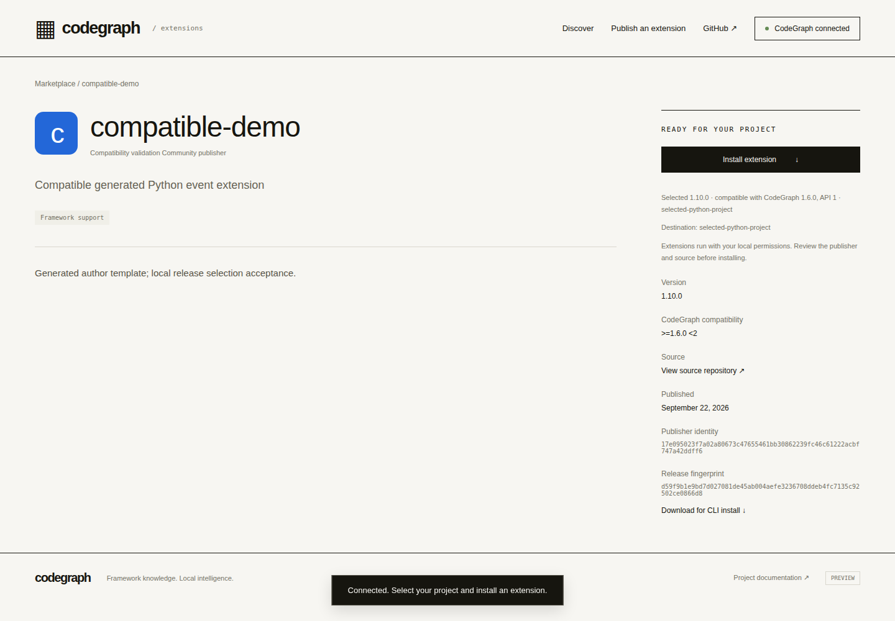
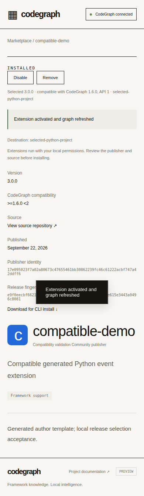

# Marketplace persistence and HTTPS validation — 2026-09-22

Implementation source: `ebf32f8fb0003189827813a64b7e3bd4f87338b4`, branch `feature/extensions-author-kit-20260922`, [draft PR #1911](https://github.com/colbymchenry/codegraph/pull/1911). Subsequent report changes contain documentation/evidence only. Full product completion and durable hosted preview readiness remain **unconfirmed**.

## Delivered implementation

- `src/plugins/marketplace.ts`: publisher ownership, immutable version, listing, artifact bytes and replay nonce commit together under `BEGIN IMMEDIATE`; WAL, full synchronization and a busy timeout support concurrent processes on one local disk. Catalog reads no longer load every artifact blob. Conflicting official seed bytes fail instead of silently reusing a version.
- `src/plugins/marketplace-storage.ts`: explicit volume identity/init, startup integrity/artifact/owner verification, online consistent snapshots with checksums/inventories, and restore exclusively into a new volume. Missing/wrong volumes and incomplete/corrupt backups fail closed. Windows file flush uses a writable handle.
- `marketplace/server/registry.cjs`: independently runnable `init`, `serve`, `verify`, `backup` and `restore`; absolute external data directory, configurable listen address/port, graceful shutdown, no ephemeral Vercel filesystem registry.
- `marketplace/server/configure-vercel.cjs`: generate fixed external HTTPS API rewrites for a deployment copy, avoiding the legacy Function gateway's 4.5 MB body limit. The fallback gateway reports missing/unreachable backend errors. Actual Vercel proxy size/caching behavior is still untested.
- Browser errors now explain registry outages. An HTTPS test exposed a delayed catalog response clearing an already entered publisher form; the form and selected File now survive that response, with a deterministic delayed-response regression.

[Deployment, persistence and recovery guide](../extensions/hosting.md) includes exact build/start/configuration/backup/isolated-restore commands and resource prerequisites. No resources were provisioned and no account/shared-host/runtime configuration was changed.

## Results and exact revisions

| Check | Revision | Result |
|---|---|---|
| Linux focused installer/runtime/author/marketplace contracts, 6 files | `63de525` | 31 passed, exit 0 |
| Linux storage subprocess matrix | `63de525` | 13 checks, exit 0 |
| Linux complete browser regression including catalog race/outage | `ebf32f8` | 15 checks, exit 0 |
| Separate application-directory replacement | `ebf32f8` source plus recorded validation script | 5 checks, exit 0 |
| Windows 2022 x64, Node 22.23.2 | `ebf32f8` | 141 focused passed, 4 POSIX skips; all 7 steps exit 0 |
| macOS 15 ARM64, Node 22.23.2 | `ebf32f8` | 144 focused passed, 1 Windows-only skip; all 7 steps exit 0 |
| Public HTTPS compatibility, Ubuntu 24.04 x64 | `f00b77b` | 9 checks, 12 CLI receipts, exit 0 |
| Final public HTTPS publisher/browser run | `ebf32f8` | **Blocked** before browser execution by tunnel DNS failures; no pass claimed |

Both final native jobs passed in [run 35694069549](https://github.com/colbymchenry/codegraph/actions/runs/35694069549). Each ran engine/frontend builds, focused tests, all 13 storage checks, 9 external-author checks, 9 compatibility checks/12 CLI receipts and 15 browser checks. The browser checks use local HTTP on these two runners. The 4 unchanged native core checks are explicitly listed as not rerun: compiled workers, native paths, and default/custom-directory lifecycle kill matrices. Their prior accepted evidence remains separate; this is not a current whole-suite/native-all-paths claim.

The 13 storage checks cover missing-volume rejection; kills before/after publication commit; rollback nonce retry and replay rejection; same-version concurrent publishers; competing ownership; new-process persistence; backup while another process has an uncommitted publication; isolated restore including actual artifact downloads; refusal to overwrite existing data; retained publisher ownership; corrupt backup rejection; wrong-volume rejection. Real test-owned children were killed; no shared process was targeted. Each child has an exit/signal/log-hash receipt.

The [deployment replacement script](marketplace-redeploy-20260922.cjs) creates two standalone application copies with the compiled registry, semver and frontend. It publishes through HTTP, kills the first service, **deletes that disposable application copy**, then starts the second copy against the same external volume. Identity, listing, artifact bytes and replay protection survive. This proves the local deployment layout; it does not substitute for a provider redeployment/persistent-disk test. Reproduce after building with `node docs/validation/marketplace-redeploy-20260922.cjs`.

## What actual HTTPS established

In [run 35693728678](https://github.com/colbymchenry/codegraph/actions/runs/35693728678), the compatibility step passed over the real public origin `https://tone-exciting-dicke-discussions.trycloudflare.com`. This was a **temporary tunnel, now closed**, serving disposable fixtures. Node and Chromium used normal certificate and browser-origin checks, without mixed-content/security bypass flags.

The browser connected through the loopback companion, selected a separate Python project, and used one Install to choose `1.10.0` over incompatible `9.0.0` and a prerelease. The actual SQLite graph linked `event:order.created` to `send_receipt`, with the extension's versioned label. Checks also covered no-compatible preservation, exact incompatible pins, explicit preview/build-metadata pins, automatic downgrade refusal, failed-update rollback, successful browser/CLI update to `3.0.0`, exact file/HTTPS artifact installs and removal. Signed submissions from the test publisher traversed the public HTTPS API. **That does not establish browser-form publication over HTTPS.**

The browser-form step in that first HTTPS run exposed the catalog/form race and failed. The fix is in `ebf32f8` and passes the 15-check local/native browser suite. [Final HTTPS run 35694069486](https://github.com/colbymchenry/codegraph/actions/runs/35694069486) could not reach either newly allocated tunnel: `getaddrinfo ENOTFOUND` for `catch-portsmouth-cms-superb.trycloudflare.com` and `procedure-fraction-carpet-camera.trycloudflare.com`. Both readiness checks exhausted 90 seconds. Earlier workspace attempts show intermittent equivalent failures, including an approved network retry. No final HTTPS publisher/origin/window/outage pass is claimed. The earlier successful HTTPS compatibility checks are retained because the only subsequent application change preserves the publisher form; they are not relabelled as a new run.

Reviewed screenshots from the successful HTTPS compatibility step:

The additional `desktop-installed.png` preserves an intermediate capture: the graph is ready but compatibility is still refreshing, so detail metadata temporarily falls back to the catalog's newest release. Installed/graph assertions prove `1.10.0`; the capture is **not evidence of installing 9.0.0**. This transient metadata presentation should be addressed in the next UI review. All screenshots and failures are retained, not edited to remove evidence.

## Hosting resource/access blocker

The authenticated Vercel MCP read found the intended Pro team `team_7CLDAquz0leU38WV3qEjBGrG`, 11 projects, and no CodeGraph project. Its exposed tools provide project/deployment reads but no storage inventory/provisioning capability. The team's storage dashboard redirects to Vercel sign-in. Consequently, an included persistent backend, local disk and independent backup destination could not be verified. This is an **access/availability unknown**, not proof that the account has no storage.

A durable preview needs an accessible included Node host with a persistent local volume, stable HTTPS ingress and an independent backup destination, or authenticated inventory permitting an appropriate included alternative. No paid provision, shared VPS service, account change, Vercel project/deployment, custom domain or production release was attempted. Backups were restored locally in isolation; no off-host schedule/retention/RPO/RTO is configured. The default gateway correctly reports unavailable when no backend is configured. There is **no durable public URL** to hand over.

Next bounded step: obtain that resource/access, deploy the prepared registry against the real volume, run backup/restore and provider redeployment checks, then repeat the complete HTTPS publisher/manage/origin/failure acceptance against the stable origin before creating/verifying the Vercel preview. The code, guide and validation workflows are runnable independently of that access.

## Evidence and retained limits

[Evidence ledger](extensions-hosting-20260922.json) contains source/compiled hashes, exact local commands/revisions/exit receipts, native command receipts and log hashes, GitHub run/job/artifact metadata, and a hash inventory of raw files under `.qa/hosting`. The storage/deployment results and test-child exits are embedded. Raw logs/artifacts are also archived outside the repository in the chat checkpoint; GitHub artifact retention is seven days.

Failed attempts remain recorded: Windows read-only fsync and mobile-hidden-link test failures at `35d7d8c` (run 35691617007), fixed and green at `63de525` (35693540734); the HTTPS catalog/form failure at `f00b77b`; subsequent tunnel DNS failures. No tests were silently excluded to convert those failures into passes.

The accepted full Linux result **4,564 passed / 192 skipped / all 280 files once** belongs to `37d4dd8`, before this registry/UI increment. It was not rerun for recovery or represented as current whole-suite evidence. Unchanged Drupal corpus accuracy, determinism and incremental convergence evidence is reused. Historical Drupal rebuild overhead remains **22–30%**, with limited samples; broader coverage/performance review remains open. Other OS/architecture/Node/browser combinations, provider volume/backup guarantees, power loss, multi-host replication/network filesystems, deployed Vercel proxy behavior and production scale remain unverified. No merge/release/npm publication, paid resource, extra model session or contributor announcement occurred.
