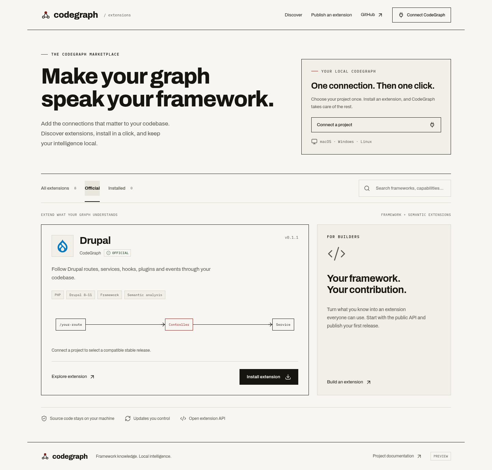
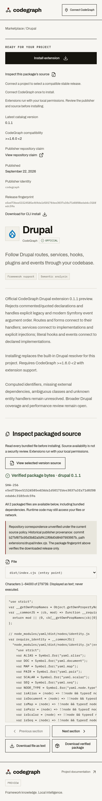

# Marketplace theme and live source UI — 2026-09-23

The [existing Cloudflare preview](https://codegraph-marketplace-preview.colby-7d9.workers.dev) now serves the checked CodeGraph theme, locally bundled Lucide icons/fonts and exact-package source viewer. The rollout changed static assets only. Publishing remains disabled; the new source-admission Worker remains staged and **was not deployed**.

Tested UI / portable static-delivery source: `b4dcb40d92f9ea19bd5098b58c1115296d65eb60`. Parent accepted milestone: `7bbce09f4b65d7a17b4c44932a061b1738c28903`. Later report/image/ledger changes do not alter tested code. Same draft [PR #1911](https://github.com/colbymchenry/codegraph/pull/1911); final verified remote SHA is recorded in the recovery checkpoint and completion receipt.

## Implementation

Catalog, detail, publisher, connection dialog and source viewer share Archivo Variable, IBM Plex Mono, `#f7f6f2` paper, `#16150f` ink, `#56544a` secondary text, thin rules and square corners. Heading weights are 700–800. The existing light-only behavior remains; no marketing/docs-site changes or new theme switch.

The pinned build uses Lucide Static **0.468.0**, Archivo Variable **5.2.8** and IBM Plex Mono **5.2.7**. Only the **26 used SVG icons** and four WOFF2 Latin subsets are bundled. Icon SVGs use `currentColor`, `aria-hidden` and `focusable=false`; containing controls retain names. The actual CodeGraph and Drupal brand marks are separate assets. Licensing and provenance are in [the asset build guide](../../marketplace/ui-assets/README.md), the committed lockfile, generated manifest and shipped license files. No CDN, runtime dependency download or icon service is required. Other glyphs use system fallbacks.

SVG descendants now resolve to their action buttons for source paging/download and key backup. Managed actions and source opening retain delegated `closest` handling. The code viewer still uses inert text and checks exact selected version/digest; HTML and bundled JavaScript are never rendered or executed by inspection. Historical Drupal repository correspondence remains explicitly unverified under the staged source policy.

The previous local Miniflare asset mock served only HTML, app.js and CSS; icons.js returned 404 and prevented rendering. It now uses native asset-first routing matching the deployed `/api/*` boundary. The portable Node server adds a bounded asset-path allowlist and proper font/SVG/text MIME types. This is the sole `src/` change, covered by real HTTP byte/MIME and traversal/unrelated-path rejection checks. Graph engine, installer, published packages, Cloudflare production Worker, registry storage and source-admission rules were not changed in this milestone.

## Current checks

All final commands below completed at clean `b4dcb40`; exact argument arrays, exits, durations, raw paths and hashes are in [the ledger](extensions-marketplace-theme-20260923.json).

| Check | Result / boundary |
| --- | --- |
| Deterministic asset build/check | 26 icons; 10 generated files, 101,981 bytes |
| TypeScript compile | Exit 0; same source bytes before commit |
| Marketplace HTTP tests | 5 passed, including new bounded asset/MIME test |
| Workerd source browser | 13 passed: real D1/R2, managed install/SQLite, inert display, tamper/selection races, paging by nested SVG, failure preservation, disable/remove |
| Portable publisher browser | 15 passed: publisher form, signing/ownership and browser/companion boundaries, updates and graph cleanup |
| Compatibility browser / CLI | 10 passed / 12 command receipts, including delayed installed/selected metadata |
| Local theme browser | 9 grouped checks; computed fonts/colors/weight/radius, keyboard focus/skip link, SVG child actions, 320/390px layout, read-only package inspection |
| Actual live HTTPS theme browser | Same 9 grouped checks against the deployed page; **no UI overlay** |
| Deployment readbacks | All 17 served static files match local SHA-256; both health/catalog/Drupal-metadata responses unchanged; Drupal 0.1.1 digest exact |

The live theme browser uses GET requests only, never installs or publishes. It generates an ephemeral browser-local signing key solely to test the backup button, deletes the download without reading its contents and closes that browser. Live installation/graph proof remains the earlier accepted hosted milestone; current managed graph regression runs locally. These are separate evidence boundaries.

The final theme test inspected loaded Archivo and IBM Plex Mono font faces and actual computed colors. No external asset requests, resource errors, CSP errors, browser errors or horizontal overflow at 320/390px occurred. Desktop/mobile catalog and source captures were inspected, along with the local desktop publisher. The harness also saved connection and publisher captures at both sizes. Representative **actual deployed** screenshots:

[Desktop source](images/marketplace-theme-20260923/desktop-source.png) · [Mobile catalog](images/marketplace-theme-20260923/mobile-catalog.png) · [Publisher](images/marketplace-theme-20260923/desktop-publisher.png) · [Mobile connection](images/marketplace-theme-20260923/mobile-connection.png)

## Exact deployment boundary

One authorized deploy, from original `c0bdbbac-adcf-4609-aaf3-a69a380f3422` to **`d87a4fa0-165e-4fb5-a6c7-96c4e0dd000a`**, with the exact archived accepted Worker:

`43dc01b6bd20160381d409c80ecd4f447ab6539a34890110e6dcad6684060561`

Its dry-run bytes match. Before/after version `resources` objects match exactly, including script ETag `2aa343f6d3cb5675e807cb91fa0e6d42aa71d8e6e0dfbf814ad038a24c395ea0`, D1/R2 bindings, `PUBLISHING_ENABLED=false`, CPU limit 1,000 ms, compatibility date and asset routing/CSP. The prepared config also preserves existing observability, workers.dev/no custom routes and all original settings; only its Worker entrypoint points to the accepted archived bundle and its asset directory is expressed as an equivalent absolute path.

The final asset inventory is **18 files / 176,817 bytes**, including `_headers`; all **17 publicly served assets** match over actual HTTPS. The main and detached restore health/catalog/release metadata bodies remain identical to their pre-rollout snapshots. There were no remote imports, package writes, catalog edits or resource creations. The detached restore was not deployed. No repeat 8 MiB, provider persistence or backup-restore matrix was necessary.

Immutable Drupal 0.1.0 stays `e5015747d02fe50d6af607b6c44f1db9cf7969a0070866ed03c7643377a459c8`; 0.1.1 stays `e5ed73bee51524585e4f4da1d5017fdee3037a3fa71d8f08edab6c318fedc59a`. The latter was also rechecked from the actual live download and browser verified-package download.

## Retained unsuccessful attempts

The pre-restart `theme-source-browser-first` timed out before any check; its failure file, log and start record remain, with **no fabricated completion receipt**. The first corrected asset-routing attempt missed Miniflare's `has_user_worker` flag and returned 500. Neither was a pass.

Four new visual-harness attempts failed on harness assumptions: measuring hidden-dialog SVG widths; requiring exactly 2px focus outlines when Chrome provided a visible 3px outline (twice); then trying to inspect a source element after navigation back to the catalog. Final checks exercise real keyboard focus and require a visible outline of at least 2px. The fifth preliminary visual run passed. A missing mobile sentence space was then corrected before the final commit.

Three simultaneous final browser runs hit initial/later navigation timeouts. Their exact failures remain. Sequential runs at identical committed source and unchanged timeouts/assertions passed; contention is suspected, not proven. The first asset install also failed on the default npm cache path; its approved retry used a task-local cache. A predeploy assertion first compared relative and absolute directory strings, then correctly resolved both to the same directory before the successful guarded deploy. All failed/incomplete attempts remain in the ledger.

## Reuse and remaining limits

Accepted source-budget/provider/core/native evidence is reused at its original source; no claim of a new full Linux/native suite is made. All 15 prior compiled ledger hashes still match (that ledger did not include the portable marketplace server, whose newly compiled hash is included here). Six prior source entries changed, explicitly listed in the ledger. Both Drupal artifacts and the full graph engine remain unchanged.

The previously accepted **$5 target for 500–1,000 daily downloads plus source views and few uploads remains conditional on shared account allowances**, not a hard cap or account-total guarantee. This rollout adds only self-hosted static files served before the Worker; no services, paid activation, resources, plan/logging change or scheduler was added. Budget assumptions and Free fallback stay in [the source/budget guide](../extensions/marketplace-budget-and-source.md). The earlier 379 ms 8 MiB publication and Free-plan limitation remain historical evidence, not a fresh load test.

Future source-policy activation requires its separately reviewed rollout; general publication stays closed. Inspectable source is not malware certification, and exact committed package correspondence is not reproducible-build verification. Prior memory/concurrency/independent backup retention and semantic-shadow no-go limits remain. No DNS/custom domain, merge, release or npm publication occurred.
