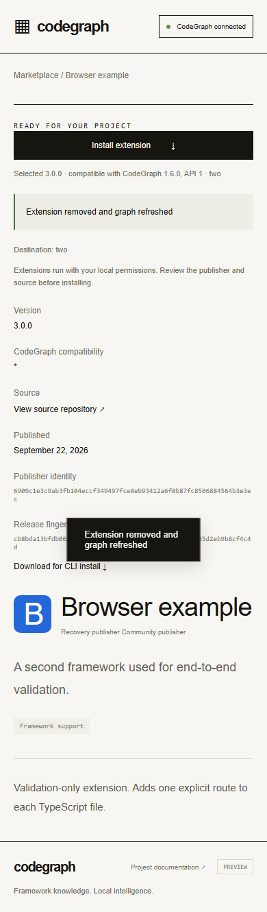

# Native extension validation and current Linux regression — 2026-09-22

Completed this bounded validation increment for draft PR [#1911](https://github.com/colbymchenry/codegraph/pull/1911),
branch `feature/extensions-author-kit-20260922`. Tested source:
**`37d4dd837120c1d56316c3cc65b6587b743a9112`**. The final report commit changes
documentation/evidence only. The full product and hosted marketplace remain incomplete.

## Results at the final source

| Check | Linux x64 | Windows 2022 x64 | macOS 15 ARM64 |
| --- | ---: | ---: | ---: |
| Engine/viewer + marketplace build | Engine/viewer build passed; native marketplace builds at right | Both exit 0 | Both exit 0 |
| Current full Vitest suite | **4,564 passed / 192 skipped / 0 failed** | Not run | Not run |
| Native focused Vitest | Covered by full suite | **136 passed / 4 skipped** | **139 passed / 1 skipped** |
| Compiled worker tests | Historical Linux evidence retained | 2 passed | 2 passed |
| Real case-alias/native-path lifecycle | Case-sensitive Linux preflight; case alias not available | Passed, alias exercised | Passed, alias exercised |
| Default-directory kill matrix | Prior 35-case Linux evidence retained | 35 passed | 35 passed |
| Custom-directory kill matrix | 35 passed | 35 passed | 35 passed |
| Fresh external-author checks | Prior Linux evidence retained | 9 passed | 9 passed |
| Compatibility checks / CLI receipts | Prior Linux evidence retained | 9 / 12 passed | 9 / 12 passed |
| Browser publisher/bridge/lifecycle | 12-check fix preflight passed | 12 passed | 12 passed |

Final [native run 35689087657](https://github.com/colbymchenry/codegraph/actions/runs/35689087657)
is **completed/success**, both jobs passing all 10 steps at the tested source.
These are real Windows and macOS processes on separate GitHub-hosted machines,
not simulated platform flags on the Linux workspace.

- Windows: `win32 x64`, OS `10.0.20348`, runner image `20260913.307.1`.
- macOS: `darwin arm64`, Darwin `24.6.0`, runner image `20260907.0337.1`.
- Linux: `x86_64`, kernel `6.8.0-139-generic`.
- All: Node `v22.23.2`. Native Chromium `153.0.8010.12`; Linux browser preflight used Chrome `153.0.8010.36`.

Each native focused run covered 11 files, including the directory-override test
and real filesystem trust aliases. Windows ran the previously skipped Windows-only
database replacement-detection contract. Its four POSIX replacement checks remain
explicitly skipped; macOS/Linux skip the Windows-only case. This does not claim
Windows can unlink an in-use SQLite database.

Each native recovery run has **70 matrix cases** across `.codegraph` and
`CODEGRAPH_DIR=.codegraph-native`, with **206 child receipts** (70 intentional
terminations, 112 successful exits, 24 expected rejection exits). Fresh processes
verify config, package/trust/version, actual SQLite contributions, graph commit or
rollback, staging cleanup, repeated recovery, live-owner exclusion, dead/torn locks,
external edits/conflicts, tampering and cached-reader invalidation. Custom-directory
cases additionally assert the default `.codegraph` is never created. Linux's custom
matrix passed all 35 cases/103 children, exit 0 in 118.381 seconds. Only disposable
test-owned subprocesses were killed: POSIX SIGKILL or Node's Windows TerminateProcess
equivalent, with actual exit/signal preserved.

## Full Linux receipts

| Shard | Passed | Skipped | Exit | Seconds |
| --- | ---: | ---: | ---: | ---: |
| 1 | 1,668 | 63 | 0 | 137.464 |
| 2 | 1,154 | 56 | 0 | 103.626 |
| 3 | 857 | 2 | 0 | 148.297 |
| 4 | 885 | 71 | 0 | 92.730 |
| **Total** | **4,564** | **192** | **All 0** | **482.117** |

All **280 discovered test files appeared exactly once**, with zero
missing, duplicate or unexpected files. The aggregate checks receipt revisions,
raw log/report hashes and complete Vitest file lists. This covers ordinary
indexing/status/sync/watch, extension-free projects, concurrency, MCP and UI tests.
The ledger lists every skipped test by file/name; no test was disabled for this milestone.
The earlier 4,545-pass result at `07b0a10` predates author/compatibility/recovery work
and is separate historical evidence.

Exact commands and exits are embedded in the JSON ledger and retained in
`.qa/native-linux-directory/shard-N.{started.json,json,tests.json,log}` plus
`checkpoint.json` and `result.json`. Each final shard ran as a separate command
to preserve progress; all four final commands completed without interruption.

```sh
# Build first for compiled-worker/CLI tests.
npm run build
# Run each N=1,2,3,4 sequentially; preserve its JSON and exit before the next.
node node_modules/vitest/vitest.mjs run --shard=N/4 --maxWorkers=2 --minWorkers=1 \
  --reporter=default --reporter=json --outputFile.json=/absolute/path/shard-N.tests.json
# Included durable four-shard runner, where continuous execution is available:
REGRESSION_OUTPUT=.qa/native-linux-fresh node scripts/validation/regression-shards.cjs
```

## Native reproduction and artifacts

`.github/workflows/extensions-native.yml` uses standard included public-repository
runners, read-only contents permission, no production secrets, at most two jobs,
and a 35-minute timeout. It never invokes `release.yml`, publishing or deployment.
After `npm ci --no-audit --no-fund`, install Playwright 1.63.0 under `.qa/browser`
and download Chromium with its CLI, then run:

```sh
node scripts/validation/native-validation.cjs
```

The runner records actual OS/architecture/image, source SHA, exact commands,
environment overrides, exits/signals, timestamps and log hashes. Checks include
generated external-author create/test/pack, signed local browser publication,
managed installation into a separate Python project, real graph contribution and
removal, worker isolation, compatible semantic versions/exact pins/rollback,
publisher ownership, origin/window restrictions, mixed-case spaced paths and
native separators. Both actual native filesystems supported the lowercase project
alias; install/open/disable/enable/remove through it passed.

- [darwin arm64 evidence artifact](https://github.com/colbymchenry/codegraph/actions/runs/35689087657/artifacts/10678411745), artifact `10678411745`, job [106622176413](https://github.com/colbymchenry/codegraph/actions/runs/35689087657/job/106622176413).
- [win32 x64 evidence artifact](https://github.com/colbymchenry/codegraph/actions/runs/35689087657/artifacts/10677512800), artifact `10677512800`, job [106622176265](https://github.com/colbymchenry/codegraph/actions/runs/35689087657/job/106622176265).

GitHub artifacts expire after seven days. Downloaded copies are retained at
`.qa/native/run-35689087657-{macos,windows}/`; all file hashes, step receipts,
child receipts, source hashes, original artifact digest/ID/expiry and job URLs
are committed in [the JSON ledger](extensions-native-20260922.json). Earlier
run artifacts remain separately under their run IDs. The local raw-evidence
archive and Git bundle are referenced by `../RECOVERY-CHECKPOINT.md` outside the repo.

Representative final macOS desktop and Windows mobile captures were inspected.
They show native destination paths, selected compatible versions, graph refresh
confirmation, and the publisher description preserved through the file-read delay.
Mobile uses desktop Chromium viewport emulation.




## Failures, fixes and interrupted attempts

- Initial [run 35687508042](https://github.com/colbymchenry/codegraph/actions/runs/35687508042)
  at `bae8e16` failed native path casing on both OSes. Trust lookup used path spelling;
  it now matches aliases only when filesystem device/inode identity proves the same
  existing approved directory. Different directories never inherit trust and
  conflicting approvals fail. Package digest validation remains mandatory.
- That run also found the macOS publisher losing entered fields during asynchronous
  package reads. Commit `258cd00` preserves changed fields and ignores stale file/form
  results. Browser tests deliberately delay `File.text()` and assert typed values
  survive. [Run 35688276005](https://github.com/colbymchenry/codegraph/actions/runs/35688276005)
  passed both native jobs at `258cd00`; it is intermediate evidence.
- Linux shard 2 at `258cd00` failed the existing `foundation.test.ts` override test
  (1,153 passed, 1 failed, 56 skipped): recovery coordination created `.codegraph`
  despite `CODEGRAPH_DIR`. Commit `70d24ab` uses the existing `getCodeGraphDir` for
  extension trust, journal, coordination, staging and graph paths. The assertion was
  not weakened. The native suite now includes foundation and the custom-directory
  kill matrix; final Linux shard 2 passes that test.
- The first custom-directory harness invocation failed on an incorrect internal
  import (`codeGraphDirName` is not a main-package export). Test-only commit
  `37d4dd8` fixes the import; production source remains the `70d24ab` fix. Known-invalid
  [run 35689016913](https://github.com/colbymchenry/codegraph/actions/runs/35689016913)
  was intentionally canceled. Failed local receipts and cancellation metadata remain.
- The original local `bae8e16` shard attempt has no completion result. A later
  four-shard wrapper at `258cd00` ended with tool exit 143 during shard 2, after a
  verified successful shard 1. That receipt was reused for the separate same-source
  attempt that exposed the real directory failure. All incomplete/failed artifacts
  remain in `.qa/native-linux`, `.qa/native-linux-fixed` and `.qa/native-linux-final`.
  Final results use only `37d4dd8`, never a mixture of source revisions. The command
  termination cause is unknown; it does not establish a host reboot or diagnose
  Hoblets. No infrastructure settings were changed.

## Limits and next bounded step

Validated combinations are Linux x64, Windows Server 2022 x64 and macOS 15 ARM64,
Node 22.23.2, local filesystems and the named Chromium builds. Windows/macOS have
focused suites, not complete whole-repository suites. macOS Intel, Windows ARM,
Linux ARM, other OS/Node versions, case-sensitive APFS, Safari/Firefox/Edge-branded
behavior, mobile-native browsers, installed release bundles, network filesystems,
machine power loss and disk corruption are untested. Simultaneous Windows/WSL
project use and mixed legacy writers bypassing coordination remain unvalidated;
direct graph/coordination-file tampering is outside the recovery contract.

Unaffected Drupal real-corpus accuracy/determinism/incremental evidence is reused;
no gratuitous corpus rerun. Historical measured rebuild overhead remains
**22–30%**, with limited samples/coverage and no broad certification of current
guard overhead. Broader Drupal/performance review and agent A/B remain open;
no extra model sessions were run.

Next bounded work is durable hosted registry/artifact storage and HTTPS-to-loopback
acceptance, then Vercel delivery and integrated review. Product code-complete: no;
this validation milestone: passed within the above scope; hosted preview-ready:
unverified; released: no. No merge, production deployment, npm release, paid
resources, account changes, contributor messages or board changes occurred.
