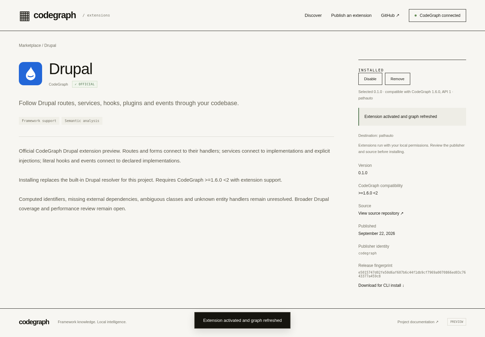
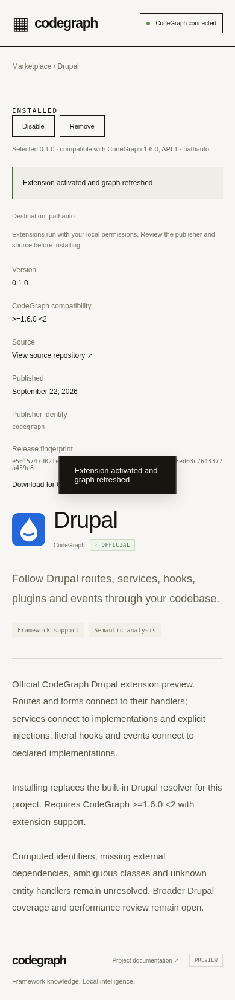

# Official Drupal operator and local Cloudflare acceptance — 2026-09-22

The reviewed Drupal artifact can now be imported into the Cloudflare registry by an explicit operator command, retain trusted CodeGraph identity/provenance through backup and restore, and install from the marketplace into a real Drupal module project. Community publication cannot assign official status. This is **local workerd/D1/R2 acceptance, not a deployed Cloudflare service**.

## Source and trust contract

Implementation source is `5d406969056bd75e48de05500f8ed9b143c1d66e`. Additional regressions and automatic CI ran at `6272db657e8d45511a2059b3fdf89d90bb81ea77`, whose delta contains only the guide and changelog. The final evidence commit also changes documentation/images only. All work continues [draft PR #1911](https://github.com/colbymchenry/codegraph/pull/1911); neither main nor the partial recovery history was overwritten.

`marketplace/cloudflare/official-policy.json` pins the existing team-owned Drupal 0.1.0 artifact: **289,167 bytes**, SHA-256 `e5015747d02fe50d6af607b6c44f1db9cf7969a0070866ed03c7643377a459c8`. It records package name, bundled entry hash, and reviewed source repository/revision/path/hash. Source is `extensions/drupal/index.cjs` at `37d4dd837120c1d56316c3cc65b6587b743a9112`; its bytes have not changed. This is a committed operator allowlist anchored to reviewed source, not a new signed upstream release or npm publication.

The operator validates package shape, API, target engine compatibility, identity and exact bytes before writing. Its plan names a registry identity and local state or remote account/Worker/D1/R2 target. Applying requires the exact reviewed plan SHA-256. Remote application additionally verifies authenticated Worker bindings before data access; it is prepared but has not been executed against an account.

Conditional R2 creation and byte readback precede a single D1 INSERT. Migration `0002_official_operator.sql` makes ownership claim and release creation atomic in that statement. Failed publication exposes no release or orphan owner; an unlisted content-addressed object may remain. Identical repeat/concurrent imports verify stored bytes and return the original immutable listing. Different owners, conflicting versions or corrupt objects fail without overwrite. Official backup validation reuses the pinned policy. No administrative or unauthenticated official HTTP endpoint was added.

## Exact local results

Linux x64, Node 22.23.2; real local workerd with D1/R2; Chromium 153.0.8010.36 for official Drupal UI acceptance. All final commands below exited **0**. Receipts record complete commands, environment overrides, source, clean/dirty state, timing and exits in the [JSON ledger](extensions-official-drupal-20260922.json).

| Command / receipt prefix under `.qa/recovery/` | Result | Source |
|---|---|---|
| `node official-test.mjs` / `official-operator-final` | **19 checks**: 17 domain/runtime/CLI checks and 2 dummy-transport remote contract checks | `5d40696` |
| `node scripts/validation/cloudflare-official-drupal.cjs` / `official-drupal-browser-final` | **8 grouped browser checkpoints**, 3 real operator CLI commands, four asserted graph edges | `5d40696` |
| `node test.mjs` / `official-worker-regression` | **21 Worker runtime checks** | `5d40696` |
| `npx vitest run … --maxWorkers=2 --minWorkers=1` / `official-shared-regression` | **35 tests / 7 files** | `6272db6` |
| `node scripts/validation/extensions-compatibility.cjs` with `CLOUDFLARE_REGISTRY=1` / `official-worker-compatibility` | **9 checks / 12 CLI receipts** | `6272db6` |
| `node scripts/validation/marketplace-browser.cjs` with `CLOUDFLARE_REGISTRY=1` / `official-worker-browser-regression` | **15 browser checks** | `6272db6` |
| `npm run build --prefix marketplace/cloudflare` / `official-build-repro` | Four existing Worker build files reproduced byte-identically | `6272db6` |
| Wrangler `deploy --dry-run --experimental-provision=false --experimental-auto-create=false` / `official-dryrun` | **147.77 KiB / gzip 27.99 KiB**, four assets; no deployment | `6272db6` |

The operator matrix covers unsupported API, malformed/incompatible/tampered packages, edited plans, wrong registry identity, community official/publisher/provenance spoofing, ownership and immutable-version conflicts, concurrent imports, R2 failure, real D1 transaction abort, safe retry, corrupt existing objects, official backup/isolated restore and explicit CLI plan confirmation. Its four CLI receipts include one **expected exit 1** for the wrong plan digest; the enclosing matrix exits 0. The two remote adapter checks use dummy credentials and an in-memory HTTP transport; they verify fixed endpoints, conditional S3 creation and binding mismatch refusal, **not live provider permissions or persistence**.

The reused Worker regression was rerun because migration, backup validation and public spoof rejection changed. It passes publication/concurrency/replay/rollback, backup/restore/runtime replacement, a full 8 MiB package with three byte-identical downloads, size/rate limits and two test-owned process kills. The seven focused files cover portable package validation, marketplace, author tooling, release selection, trust, plugins and storage. The existing Worker browser regression retains publisher ownership, origin/window restrictions and outage behavior. Unaffected large Drupal corpus and full native kill matrices were not repeated.

### Real Drupal graph and browser proof

The acceptance script exports a clean copy of Pathauto at **`b97aadf47a37cff25f7d6105c3dade6778fccb47`** to a disposable project. The source corpus remains untouched. The actual operator CLI imports the pinned artifact into real workerd D1/R2. Catalog, Official filter and detail show Drupal 0.1.0, **CodeGraph**, `publisherId: codegraph`, official status and expected digest. One connection popup and one Install update only the selected project; a separate project stays uninitialized.

The installed SQLite graph has **1,103 nodes, 1,867 edges, including 66 Drupal extension edges**. Four specific edges are asserted by source/target names, file paths and labels:

| Source | Target | Extension label |
|---|---|---|
| `/admin/config/search/path/settings` in `pathauto.routing.yml` | `PathautoSettingsForm.buildForm` | Drupal route handler |
| `/admin/config/search/path/update_bulk` in `pathauto.routing.yml` | `PathautoBulkUpdateForm.buildForm` | Drupal route handler |
| `AliasCleaner.getPunctuationCharacters` | `PathautoCustomPunctuationTestHooks.pathautoPunctuationCharsAlter` | Drupal hook pathauto_punctuation_chars_alter |
| `PathautoGenerator` | `AliasCleaner` | Drupal service injection |

The other 62 extension edges are counted, not individually certified by this test. `graph-proof.json` preserves the graph digest and precise file paths. A corrupted registry download fails while retaining identical graph digest and configuration; malformed/incompatible direct managed installs also preserve the working graph/configuration. Browser disable clears extension contributions, enable restores the four expected links, and remove clears contributions and installed configuration. No page errors were recorded. The executable script records **8 grouped checkpoints**; earlier progress shorthand saying nine was a counting error, not an additional result.

Desktop and mobile screenshots were inspected. They show the official identity, destination, selected version, compatibility and installed/manage state:





## Automatic CI and retained attempts

[Native run 35727987357](https://github.com/colbymchenry/codegraph/actions/runs/35727987357), source `6272db6`, passed on **Windows 2022 x64 (141 focused tests / 4 skips)** and **macOS 15 ARM64 (144 / 1)**. Each passed builds, 13 portable storage cases, nine external-author checks, nine compatibility checks/12 CLI commands and 15 browser checks. Artifact step log hashes match their exit receipts. These existing jobs exercise the **separate portable Node backend**, not the new official Worker CLI on native operating systems.

[Automatic temporary HTTPS run 35727987378](https://github.com/colbymchenry/codegraph/actions/runs/35727987378) failed overall. Builds and **nine Node-backend HTTPS compatibility checks** passed; the publisher browser step exited 1 **before browser acceptance**, with zero checkpoints, because its tunnel hostname repeatedly returned `ENOTFOUND`. All step log hashes were checked. No tests were excluded or assertions weakened; no repeat dispatch was used to chase a green result. Prior successful Node HTTPS runs remain evidence for that separate backend, not a current all-green CI claim or Cloudflare hosting proof.

Early local operator/browser passes ran with dirty source based on `55fb979` and are retained separately; final passes above ran on committed source. A preliminary `npm exec … node --version` probe failed while trying to use the absent default npm cache; this was a tooling probe, not an executed acceptance test. Actual validation used the installed Node binary. The failure and its exit-1 receipt remain preserved. All final local acceptance commands passed.

## Operator usage and remaining gates

Follow the [operator guide](../extensions/official-drupal-import.md) for dependencies, migrations, public policy, explicit targets and remote permissions. With a stopped, initialized local rehearsal registry, from `marketplace/cloudflare`:

```sh
node official-cli.mjs inspect-local /absolute/state > /absolute/target.json
node official-cli.mjs plan /absolute/target.json /absolute/drupal.cgext /absolute/new-plan.json
node official-cli.mjs apply /absolute/new-plan.json --confirm-plan-sha256 REVIEWED_HASH
```

The final command requires the digest printed for the reviewed plan. No remote apply, credential inspection, browser takeover, provisioning or DNS change occurred. Klaus retains the pending account access step. Before remote execution, verify the account/plan and existing authorized preview Worker, D1 and private R2 resources, migration 0002, deployed bindings, exact registry identity, supported engine and D1/Worker-read/bucket-scoped R2 credentials. Default R2 endpoints are implemented; jurisdiction-specific endpoints still need reviewed configuration and validation.

**No durable Cloudflare URL, provider redeploy/persistence, remote backup/restore, independent retention or deployed Free-plan CPU fit is established.** The D1 ID remains a placeholder and publishing defaults false. `marketplace.getcodegraph.com` is proposed and unconfigured. The [hosting guide](../extensions/cloudflare-hosting.md) retains request/storage assumptions and the **10 ms Workers Free CPU** risk for maximum-size packages. Local 8 MiB success is not remote CPU billing evidence; free allowances are neither a zero-cost guarantee nor permission to activate paid resources.

Next independent milestones: broader Drupal accuracy/performance review and final integrated regression. Historical Drupal rebuild overhead remains **22–30%** with limited samples. The prior 4,564-pass full Linux suite at `37d4dd8` predates hosting/operator changes and is not a current whole-suite claim. Full product completion remains partial. No merge, release, production deployment, npm publication, paid activation or contributor announcement.
